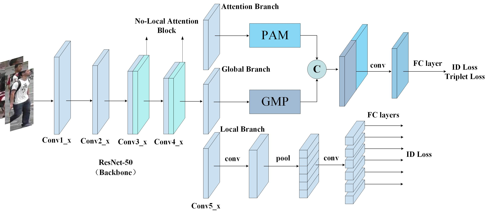
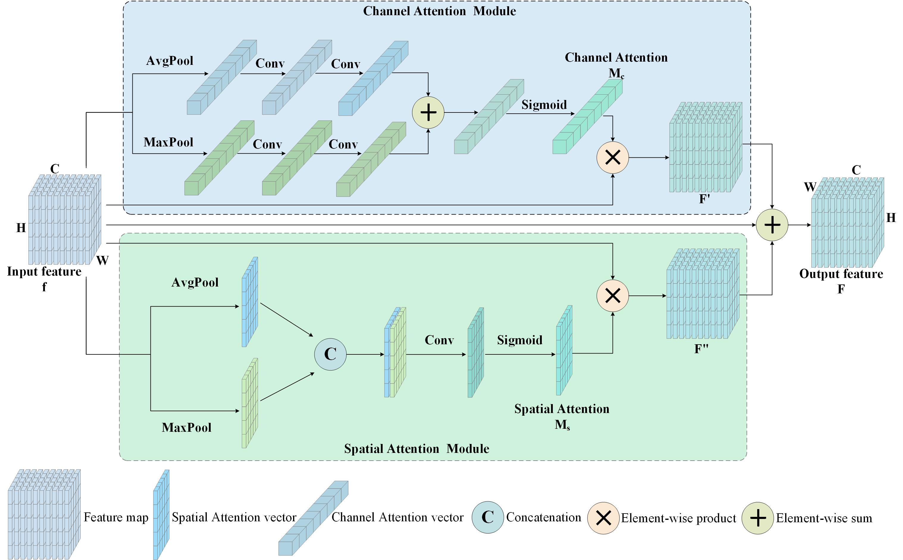

# Multi-branch Attention Feature Fusion Network for Person Re-identification

## The innovations of this paper include the following:
<li>We propose a novel Multi-branch Attention Feature Fusion Network (MAFFN) is proposed, which extracts features at different scales through a multi-branch structure and improves robustness by fusing different branch features. </li>
<li>We design a Parallel Attention Module (PAM), which extracts the discriminative information of pedestrians through channel and spatial attention, and the parallel structure both improves the model efficiency and enhances the intercorrelation between features through fusion technique. </li>
<li>Experiments on the Market-1501, DukeMTMC-ReID, and CUHK03 datasets show that MAFFN outperforms the comparative methods and achieves the best level of performance in the three datasets tested. </li>

## Description of the key algorithms
### 1.Feature fusion between different branches

Inter-branch feature fusion makes full use of the complementary information of different branches by designing global branch, local branch and attention branch. The global branch extracts overall features through generalised average pooling, the local branch obtains fine-grained local information through horizontal chunking, and the attention branch extracts multi-dimensional attention features through PAM. Subsequently, the output of the attention branch is spliced with the global features in the channel dimension, and the interaction and correlation of the features are enhanced by the convolutional dimensionality reduction operation. Eventually, the fused features are combined with the fine-grained features extracted by the local branch to form comprehensive discriminative features for the pedestrian re-identification task, which significantly improves the robustness and adaptability of the model in complex scenes.

### 2.Parallel Attention Module

PAM extracts multidimensional discriminative information of the feature map through channel attention and spatial attention mechanisms to enhance the robustness of pedestrian features. The channel attention mechanism generates global feature descriptors by average pooling and maximum pooling of the input feature map, which are then multiplied element-by-element with the original features after generating channel weights via the shared fully-connected layer to enhance important channel information. The spatial attention mechanism, on the other hand, generates spatial feature descriptors through average pooling and maximum pooling of channel dimensions, and inputs the two into the convolutional layer to generate spatial weights after splicing, which are then applied to the feature map to highlight key location features. Ultimately, the channel and spatial attention features are summed with the original features to obtain the fused attention features to improve the discriminative power and efficiency of the model.

## Datasets: 
All three datasets are publicly available and download links have been provided to access the datasets by clicking on the corresponding dataset.The dataset used for the experiment is as follows：

[Market1501](https://github.com/sybernix/market1501)

[DukeMTMC-ReID](https://gitcode.com/Resource-Bundle-Collection/f7e06/?utm_source=pan_gitcode&index=top&type=card&)

[CUHK03](https://aistudio.baidu.com/datasetdetail/86044/0)


## Quick Star
1.Prepare dataset

Create a directory to store reid datasets under this repo, taking Market1501 for example
```
cd MAFFN
mkdir datasets
```
* Set _C.DATASETS.ROOT_DIR = ('./datasets') in config/defaults.py
* Download dataset to datasets
* Extract dataset and rename to market1501. The data structure would like:
```
datasets
    market1501
        bounding_box_test/
        bounding_box_train/
        ......
```
The rest of the dataset operates as above

2.Install dependencies

Algorithm dependencies are installed as described in the requirements.txt file

3.Train and Test
Enter the following commands to train and test the model:
```
python tools/main.py --config_file='configs/experiment.yml' DATASETS.NAMES "('market1501')"
```
```
python tools/main.py --config_file='configs/experiment.yml' DATASETS.NAMES "('market1501')"  MODEL.PRETRAIN_CHOICE "('self')" TEST.WEIGHT "('./pretrained/market1501_AGW.pth')" TEST.EVALUATE_ONLY "('on')"
```

### Please consult the author for code issues.
Contact: Z20231090862@stu.ncwu.edu.cn or HNYCJL@163.com or 1710715380@qq.com
